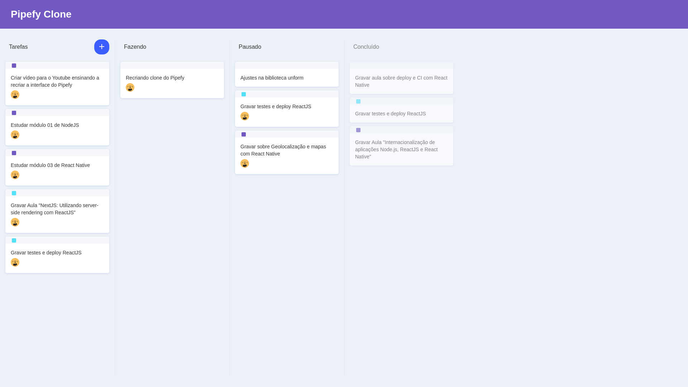

# pipefy-front-end-clone

This is a simple pipefy clone, focusing on creating the main features of the platform. For now the only available feature is the drag and drop one.

In the future, more features will be available, as well as a backend, (probably) made with elixir
<p align="center">
    
</p>

##### Running 

This is a common react app, so all that must be done in order to run it is installing the necessary packages with 

```
yarn install
```

or 

```
npm install
```

and then runnig it with

```
yarn start
```

or 

```
npm start
```